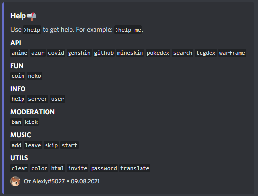

 

<h3 align="center">Furret</h3>

 Discord bot for text commands
     

## 📝 Table of Contents

- [About](#about)
- [Demo](#demo)
- [Usage](#usage)
- [Getting Started](#getting_started)
- [Acknowledgments](#acknowledgement)

## 🧐 About 

Multi purposes discord bot.

## 🎥 Demo 

## 🎈 Usage 

Check all commands

`$help`

### Example

`$coin`

## 🏁 Getting Started 

### Prerequisites

`node >= 12`

### Installing

Install dependencies

`npm i` / `yarn` / `pnpm i`

Start the bot

`npm run start` / `yarn start` / `pnpm run start`

Type `$help` to see all commands!

## 🎉 Acknowledgements 

- Hat tip to anyone whose code was used
- Inspiration
- References
